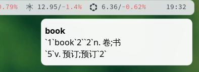
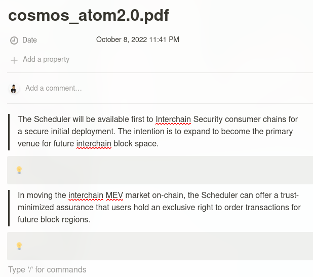
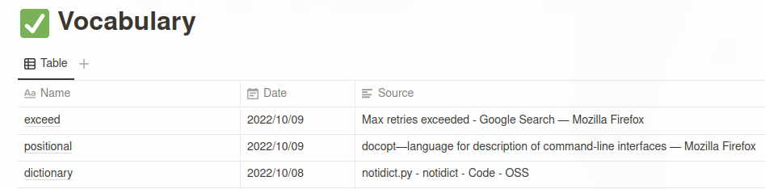
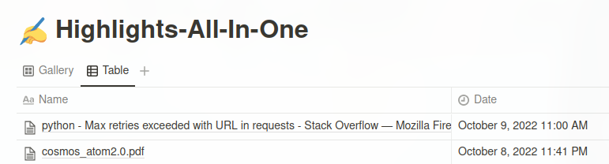

=============================================================================
``NotionDict`` - A terminal dictionary application
=============================================================================
.. image:: https://api.travis-ci.com/PixelHegel/NotionDict.svg?branch=main
        :target: https://app.travis-ci.com/github/PixelHegel/NotionDict

NotionDict
----------
NotionDict is a terminal dictionary application, you can use it to query the words from your own .mdx files,and the result will be shown by system notification. And it also supports uploading the result to Notion. You also can use it to upload highlight text to Notion. The best practice is to bind a shortcut to the app, then you can easily query the dict and highlight text anywhere.

What NotionDict can do?
-----------------------
1. Query the selected word and show the result by system notification, at the same time, the word will be saved to your Notion database.

2. Highlight the selected text, and sync the selected text to your Notion database, the title of the acitve window will be sent to Notion as well. So you can get the highlight text of one pdf in one Notion page.

The two functions are sepreate functions, you can use only one of them or both.

Preparation
-----------
1. Create two databases,  one for saving queried words, the other one for saving highlight texts.

The sturcture of vocabulary database:

Name: Save the words

Source: Save the source of the word (the active window title when you query the word)

Date: Query date

The sturcture of highlights database:

Name: The page name(the active window title when you save the highlight), highlights from same webpage/app will be saved in same notion page.

Date: Save date

2. You need a .MDX dictionary file to query the word, find the .MDX dictionary you perfer then put it path into config file or env variables.

Installation
------------

::

    pip install notiondict

Usage
-----

::

    Usage:
    notiondict dict <word> [--config <file-path>]
    notiondict highlight <text> [--config <file-path>]
    notiondict -h | --help

    Options:
    --config <file-path>  your own config file
    --help -h  show help

Examples
--------

::

    notiondict dict book --config /home/username/config.yml
    notiondict highlight "This is a highlight"

Contents of requirements.txt

::

    docopt==0.6.2
    pyclip==0.6.0
    PyYAML==6.0
    readmdict==0.1.1
    requests==2.28.1
    setuptools==63.0.0
    urllib3==1.26.12

Config file
-----------
Your need to save your Notion database id and Notion API Key in env variables or config file:

For env variables:

::

    NOTION_HIGHLIGHT_DATABASE: Your_Notion_Database_Page_ID
    NOTION_VOCABULARY_DATABASE: Your_Notion_Database_Page_ID
    DICT_PATH: Your_Dict_Path
    NOTION_API_KEY: Your_Notion_API_KEY 

For config file:

There is a config file example in the repo, attach the config file by this way when you run NotionDict:

::
    
    notiondict dict book --config /home/username/config.yml

Best practice
-------------
For Linux:

Use xsel to pass the selected text to NotionDict

::

    notiondict dict "`xsel`"

For MacOS:

You can create a Shortcut to pass the acitve action to terminal.